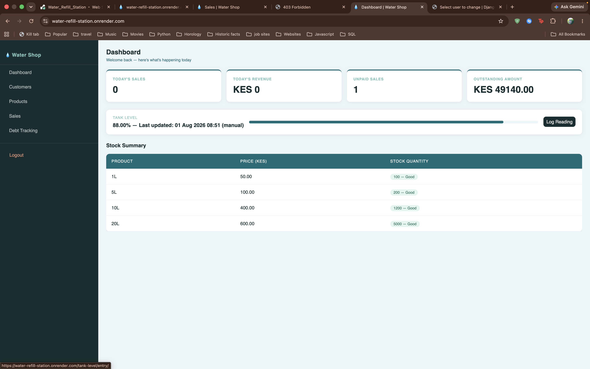
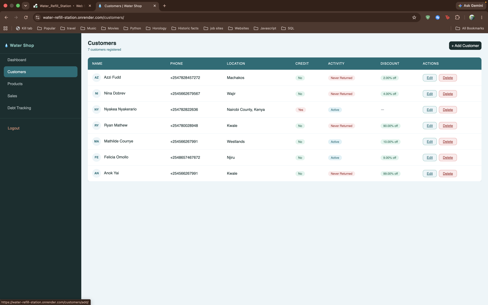
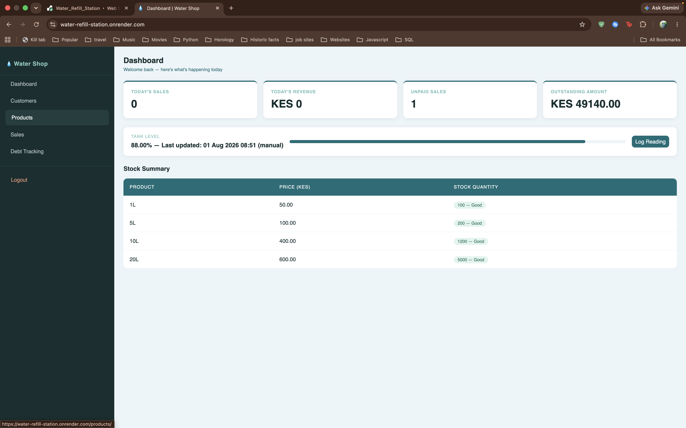
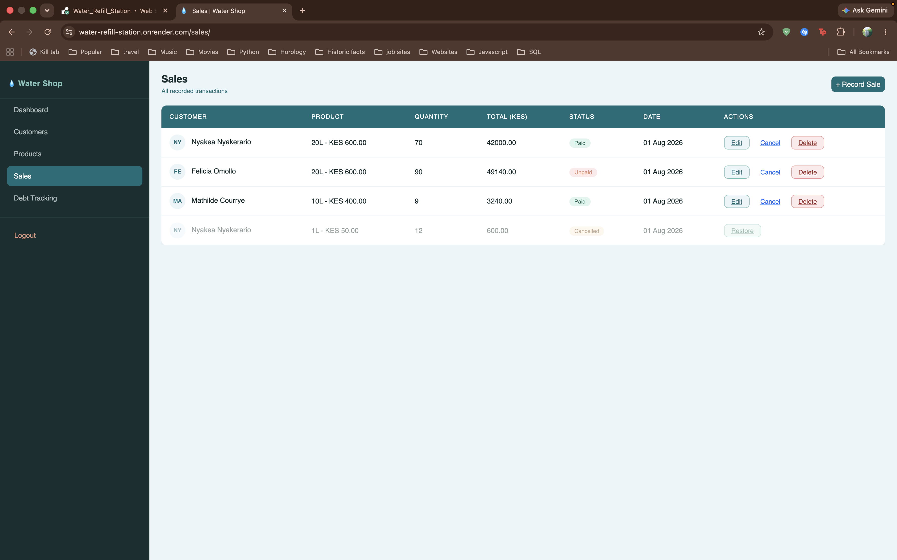
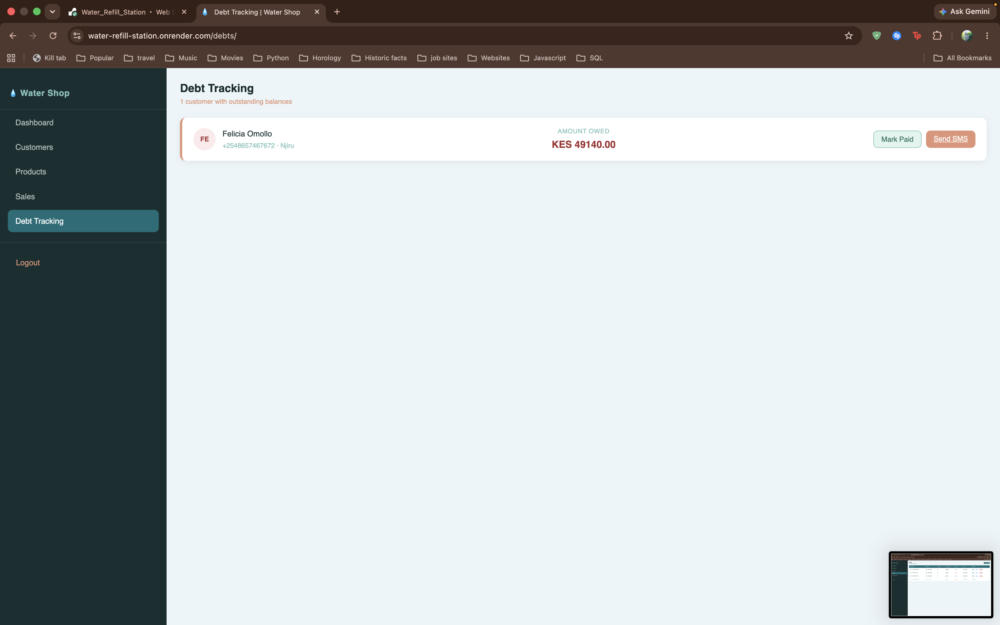
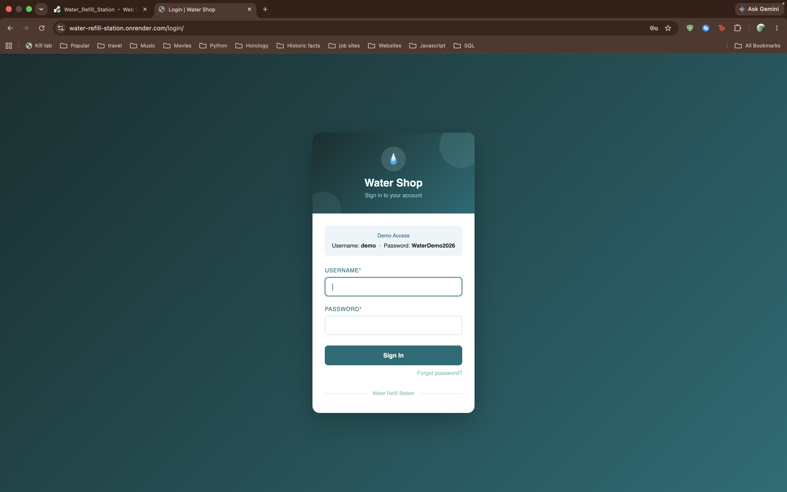

# Water Refill Station

A full-stack Django web application built to manage daily operations for a water refilling business. This project is based on a real business my friend runs, and was developed over a structured multi-week build covering backend logic, database design, third-party API integration, UI/UX design, and production deployment.

**Live demo:** https://water-refill-station.onrender.com

**Demo login:** Username `demo` · Password `WaterDemo2026`

*(Note: the free-tier database resets periodically — if the demo looks empty, the data may need reseeding.)*

## Motivation

My friend runs a water refilling shop, which I worked in a few weeks back and wanted to solve real operational problems: tracking who owes money, knowing when stock is low, sending customers reminders about debts or promotions, and eventually monitoring tank levels without manually checking. Rather than build a generic tutorial project, this app is shaped around the actual day-to-day needs of the business.

## Tech Stack

- **Backend:** Django 5.2
- **Database:** PostgreSQL
- **Frontend:** Bootstrap 5.3, django-crispy-forms, custom CSS theme
- **API:** Django REST Framework (tank level monitoring endpoint)
- **SMS:** Africa's Talking API (debt reminders, low-tank alerts)
- **Deployment:** Render (web service + managed PostgreSQL)
- **Static files:** WhiteNoise
- **Environment management:** python-decouple

## Features

### Customer Management
- Full CRUD for customer records (name, phone, location, credit status)
- Activity tracking — customers automatically tagged as Frequent, Active, Inactive, or Never Returned based on purchase history
- Discount field for rewarding frequent customers, applied automatically to future sales

### Product Management
- Manage the four container sizes (1L, 5L, 10L, 20L), pricing, and stock levels
- Low-stock and critical-stock visual indicators

### Sales Tracking
- Record sales with auto-calculated totals (including any customer discount)
- Mark sales as paid or unpaid
- Cancel and restore sales without permanently losing the record (soft-cancel, not delete)

### Debt Tracking
- Filter all customers with outstanding balances
- One-click "mark as paid" to clear a customer's debt
- Send a customized SMS reminder directly to a customer via Africa's Talking

### Dashboard
- Live stats: today's sales, today's revenue, unpaid sales, outstanding amount
- Frequent customers widget with reward shortcuts
- Current tank level with color-coded status and manual logging
- Stock summary across all products

### Tank Level Monitoring
- REST API endpoint (Django REST Framework) built to accept readings from an IoT sensor (ESP32 + ultrasonic sensor) in the future
- Manual entry option for the shop owner in the meantime
- Automatic low-level SMS alert when the tank drops below 20%

### Authentication
- Login and logout with Django's built-in auth system
- Full password reset flow with custom-styled templates
- All application views protected behind login

## Screenshots

### Dashboard


### Customers


### Products


### Sales


### Debt Tracking


### Login


## Local Setup

These instructions assume macOS with Homebrew.

### Prerequisites

- Python 3.10+
- PostgreSQL 16
- Git

### Installation

Clone the repository:

```bash
git clone git@github.com:feliciaomollo/Water_Refill_Station.git
cd water_shop
```

Create and activate a virtual environment:

```bash
python3 -m venv venv
source venv/bin/activate
```

Install dependencies:

```bash
pip install -r requirements.txt
```

Create a `.env` file in the project root:

```
SECRET_KEY=your-secret-key
DEBUG=True
DB_NAME=water_shop_db
DB_USER=your-postgres-username
DB_PASSWORD=
DB_HOST=localhost
DB_PORT=5432
ALLOWED_HOSTS=127.0.0.1,localhost
AT_USERNAME=sandbox
AT_API_KEY=your-africas-talking-key
OWNER_PHONE=+254XXXXXXXXX
EMAIL_BACKEND=django.core.mail.backends.console.EmailBackend
```

Create the PostgreSQL database:

```bash
createdb water_shop_db
```

Run migrations:

```bash
python manage.py migrate
```

Start the development server:

```bash
python manage.py runserver
```

The app will be available at `http://127.0.0.1:8000/`.

## Deployment

Deployed on Render as a web service connected to a managed PostgreSQL database. Key production configuration:

- `DEBUG=False` with full HTTPS enforcement (SSL redirect, secure cookies, HSTS)
- WhiteNoise for serving static files without a separate CDN
- Gunicorn as the production WSGI server
- Environment variables managed through Render's dashboard, mirroring the local `.env` structure

## Project Structure

```
water_shop/
├── core/           # Project configuration (settings, URLs, WSGI)
├── shop/           # Main application
│   ├── models.py
│   ├── views.py
│   ├── forms.py
│   ├── serializers.py
│   ├── sms.py
│   ├── templates/shop/
│   └── static/shop/
├── manage.py
├── requirements.txt
├── Procfile
└── .env            # Not committed; holds local secrets and DB credentials
```

## Development Workflow

This project follows a feature-branch workflow:

1. Create a branch for each feature (e.g. `feature/customer-analytics`)
2. Commit work incrementally with descriptive messages
3. Push the branch and open a pull request into `main`
4. Review the diff, merge, and sync local `main`

This kept `main` in a stable, working state throughout development, with each feature isolated and reviewable in its own pull request.

## Roadmap

- M-Pesa STK Push integration for direct customer payments
- IoT hardware integration (ESP32 + ultrasonic sensor) for automated tank level readings
- Search and filtering on customer and sales list pages
- Pagination for large datasets
- Automated test coverage

## Author

Felicia Omollo